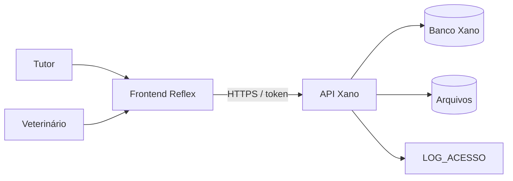
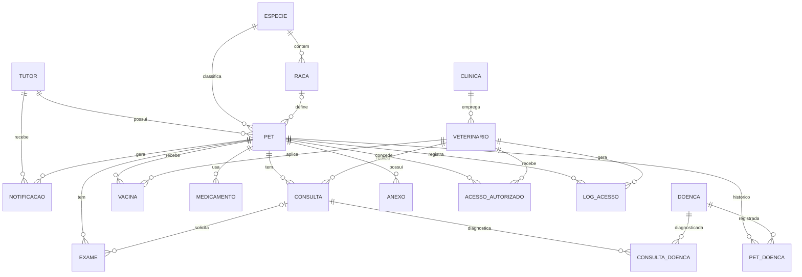
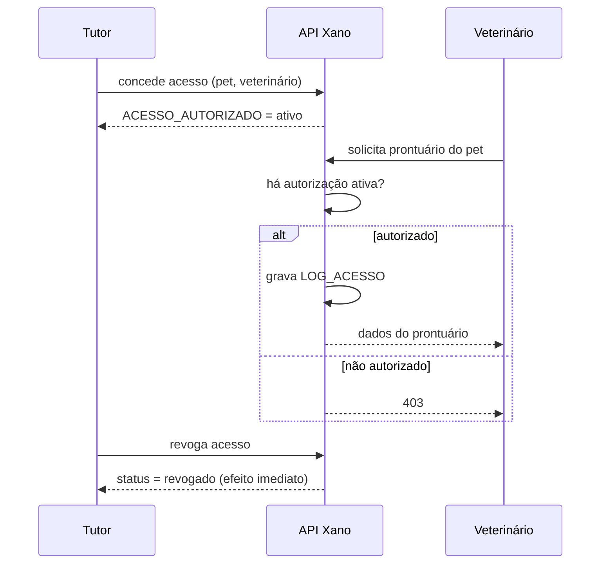

# Vet-Tech[README.md](https://github.com/user-attachments/files/32919296/README.md)
# 🐾 VetTech

> Prontuário digital para pets: o histórico de saúde do animal acompanha o pet por toda a vida, independentemente de clínica, cidade ou veterinário.


---

## 📖 Sobre o projeto

O **VetTech** é uma plataforma web que centraliza o histórico médico completo de cada pet em um ambiente seguro e acessível. O sistema conecta **tutores** e **veterinários**: o tutor é dono dos dados do animal e decide quem pode acessá-los.

### O problema

O histórico médico de pets está fragmentado em cadernetas de papel, arquivos físicos e sistemas isolados de cada clínica, o que causa:

- repetição desnecessária de exames;
- risco de erro médico por falta de informação (ex.: alergias não comunicadas);
- perda de continuidade no acompanhamento de doenças crônicas;
- dificuldade do tutor em controlar vacinas e medicações.

### Objetivos

- Centralizar o histórico médico de cada pet em um único sistema.
- Garantir que o prontuário acompanhe o pet independentemente da clínica atendida.
- Reduzir riscos médicos causados por falta de informação nos atendimentos.
- Dar ao tutor controle sobre quem acessa os dados do seu animal.
- Facilitar o acompanhamento de vacinas, medicações e retornos com lembretes automáticos.

---

## 👥 Perfis de usuário

| Perfil | Necessidade | Pode |
|---|---|---|
| **Tutor** | Organização e controle da saúde dos pets | Gerenciar os próprios pets, conceder/revogar acesso a veterinários, ver histórico de acessos, receber notificações, exportar PDF |
| **Veterinário** | Acesso rápido e confiável ao histórico do paciente | Registrar consultas, vacinas e diagnósticos **somente** em pets com autorização ativa |
| **Clínica** | Agrupar veterinários | Empregar vários veterinários. **Não acessa prontuários diretamente**; o acesso é sempre individual |

---

## ✨ Funcionalidades

| # | Funcionalidade | Descrição |
|---|---|---|
| RF01 | Cadastro e autenticação | Tutores e veterinários se cadastram e fazem login |
| RF02 | Perfil do pet | Dados, foto, espécie e raça |
| RF03 | Histórico médico | Consultas, exames e diagnósticos |
| RF04 | Carteira de vacinação | Vacinas aplicadas com alerta de reforço |
| RF05 | Controle de medicamentos | Contínuos, vermífugo, antipulgas/carrapatos e outros |
| RF06 | Registro de doenças | Diagnóstico pontual (por consulta) e histórico consolidado (por pet) |
| RF07 | Permissões | Tutor autoriza e revoga o acesso de veterinários |
| RF08 | Log de auditoria | Quem acessou, editou ou exportou dados |
| RF09 | Notificações automáticas | Vacina, retorno e medicamento |
| RF10 | Exportação | Relatório PDF do histórico completo |

### Fora do escopo inicial (evolução futura)

- Módulo de pagamento
- Telemedicina em vídeo
- Aplicativo mobile nativo

---

## 🏗️ Arquitetura

| Camada | Tecnologia | Responsabilidade |
|---|---|---|
| Banco de dados | **Xano** | Tabelas, relacionamentos e integridade |
| Backend / API | **Xano (xanoscript)** | Regras de negócio, autenticação, validações e autorização |
| Frontend | **Python + Reflex** | Interface web responsiva com dashboards distintos para tutor e veterinário |
| Arquivos | URL/arquivo vinculado ao pet | Exames, laudos, receitas e fotos |



---

## 🗃️ Modelo de dados

> **Fonte de verdade:** o modelo de dados (DER) e o xanoscript em [`/xano`](./xano). Toda alteração na modelagem deve ser refletida no diagrama e no script.



Detalhes de cada entidade, campos e regras estão em [`docs/domain-model.md`](./docs/domain-model.md).

---

## 🔐 Permissões, auditoria e LGPD

- O **tutor** é o único que concede ou revoga o acesso de veterinários ao prontuário do seu pet.
- O **veterinário** só visualiza, edita ou exporta dados de pets com autorização **ativa**; ao ser revogada, o acesso é perdido imediatamente.
- Toda visualização, edição ou exportação gera um registro **imutável** em `LOG_ACESSO` (data, veterinário, pet e ação).
- Senhas são armazenadas com **hash**, nunca em texto puro.
- A auditoria e o controle de acesso seguem os princípios da **LGPD**.



---

## 🧭 Spec-Driven Development com OpenSpec

Este projeto é desenvolvido com **Spec-Driven Development (SDD)**: primeiro a especificação, depois o código. Usamos o [OpenSpec](https://github.com/Fission-AI/OpenSpec) para propor, validar e arquivar mudanças, com apoio de agentes de IA.

### Como funciona

1. **Explorar:** entender o problema e o código atual antes de mudar algo.
2. **Propor:** criar uma mudança em `openspec/changes/<nome-da-mudanca>/` com proposta, design e tarefas.
3. **Aplicar:** implementar as tarefas seguindo a especificação.
4. **Sincronizar:** atualizar as specs principais em `openspec/specs/` com o que foi definido.
5. **Arquivar:** mover a mudança concluída para `openspec/changes/archive/`.

### Skills de agente disponíveis

As skills ficam em [`.github/skills`](./.github/skills):

| Skill | Para que serve |
|---|---|
| `openspec-explore` | Explorar ideias e investigar o projeto |
| `openspec-propose` | Propor uma nova mudança com artefatos de especificação |
| `openspec-apply-change` | Implementar as tarefas de uma mudança |
| `openspec-update-change` | Ajustar uma mudança em andamento |
| `openspec-sync-specs` | Sincronizar as specs principais |
| `openspec-archive-change` | Arquivar uma mudança concluída |

> As instruções para agentes de IA estão em [`AGENTS.md`](./AGENTS.md) e [`CLAUDE.md`](./CLAUDE.md).

---

## 📁 Estrutura do repositório

```text
vet-tech/
├── .github/            # Prompts, skills e workflows (OpenSpec / Copilot)
├── assets/             # Arquivos estáticos (ex.: favicon)
├── docs/               # Documentação do projeto e modelo de domínio
├── openspec/           # Especificações (SDD): specs/ e changes/
├── vet_tech/           # Frontend em Reflex
├── xano/               # xanoscript e artefatos do backend
├── AGENTS.md           # Instruções para agentes de IA
├── CLAUDE.md           # Instruções para o Claude
├── requirements.txt    # Dependências Python
├── rxconfig.py         # Configuração do Reflex
└── README.md
```

| Documento | Conteúdo |
|---|---|
| [`docs/project-overview.md`](./docs/project-overview.md) | Visão geral do projeto |
| [`docs/domain-model.md`](./docs/domain-model.md) | Entidades, relacionamentos e regras de domínio |
| [`docs/DOCUMENTACAO.md`](./docs/DOCUMENTACAO.md) | Documentação completa (requisitos, regras de negócio, arquitetura) |

---

## 🚀 Como rodar localmente

### Pré-requisitos

- Python 3.11 ou superior
- Git
- Uma conta no [Xano](https://www.xano.com/) com o workspace do projeto configurado

### Passo a passo

```bash
# 1. Clone o repositório
git clone https://github.com/sabortech/vet-tech.git
cd vet-tech

# 2. Crie e ative o ambiente virtual
python -m venv .venv
source .venv/bin/activate        # Linux/macOS
# .venv\Scripts\activate         # Windows

# 3. Instale as dependências
pip install -r requirements.txt

# 4. Inicie o Reflex
reflex run
```

O app abre em `http://localhost:3000`.

### Configuração do backend (Xano)

Configure a URL base da API do seu workspace Xano no frontend (`vet_tech/`) e importe o xanoscript da pasta [`xano/`](./xano) para recriar as tabelas e endpoints.

> ⚠️ A pasta `reflex.lock` é gerada automaticamente pelo Reflex e não deve ser versionada.

---

## 🗺️ Estratégia de desenvolvimento

Desenvolvimento incremental por módulo:

1. Modelagem do banco (DER e xanoscript)
2. Definição da arquitetura (backend/frontend)
3. Cadastro → prontuário → permissões → notificações
4. Testes com dados simulados (mock data)
5. Ajustes de usabilidade nas telas do tutor e do veterinário
6. Documentação final para entrega acadêmica

### Princípios de modelagem

- Modelagem orientada ao usuário final: pet e tutor no centro, não a clínica.
- Normalização para evitar inconsistências (espécie/raça padronizadas).
- Tabelas associativas para relações N:N (Pet-Doença, Consulta-Doença).
- Documentação incremental do modelo conforme surgem novas necessidades.

---

## ❓ Pontos em aberto

- [ ] **Anexos de exame:** definir se haverá relação direta EXAME–ANEXO.
- [ ] **Data de retorno:** `CONSULTA` ainda não tem campo de data de retorno.
- [ ] **Perfil administrador:** o log é consultável pela administração, mas não há perfil admin descrito.
- [ ] **Cadastro de pet:** confirmar que apenas o tutor cadastra pets.
- [ ] **Canal de notificação:** apenas dentro do sistema ou também por e-mail?
- [ ] **Relação Pet–Veterinário:** confirmar se `ACESSO_AUTORIZADO` basta ou se haverá vínculo clínico separado.

---

## 📚 Glossário

| Termo | Significado |
|---|---|
| Tutor | Responsável legal e dono dos dados do pet |
| CRMV | Registro profissional do médico-veterinário |
| SRD | Sem raça definida |
| Prontuário | Histórico médico consolidado do pet |
| Diagnóstico pontual | Doença identificada em uma consulta específica |
| Histórico consolidado | Situação das doenças do pet ao longo do tempo |
| DER | Diagrama entidade-relacionamento |
| SDD | Spec-Driven Development |
| LGPD | Lei Geral de Proteção de Dados |

---

## 🤝 Contribuindo

1. Crie uma branch a partir da `main`: `git checkout -b feat/nome-da-mudanca`
2. Proponha a mudança com o OpenSpec **antes** de implementar.
3. Implemente seguindo a especificação e mantenha o DER e o xanoscript consistentes.
4. Faça commits claros e abra um Pull Request.

## 👨‍💻 Equipe

<table>
  <tr>
    <td align="center">
      <a href="https://github.com/7offdvx">
        <br />
        <sub><b>@7offdvx</b></sub>
      </a>
    </td>
    <td align="center">
      <a href="https://github.com/danikellyalves">
        <br />
        <sub><b>@danikellyalves</b></sub>
      </a>
    </td>
    <td align="center">
      <a href="https://github.com/vitor0sousa">
        <br />
        <sub><b>@vitor0sousa</b></sub>
      </a>
    </td>
  </tr>
</table>

## 📄 Licença

<!-- Defina a licença do projeto (ex.: MIT) -->
Projeto desenvolvido para fins acadêmicos.
