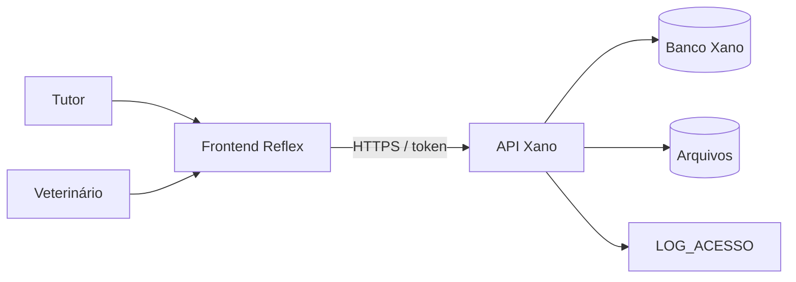
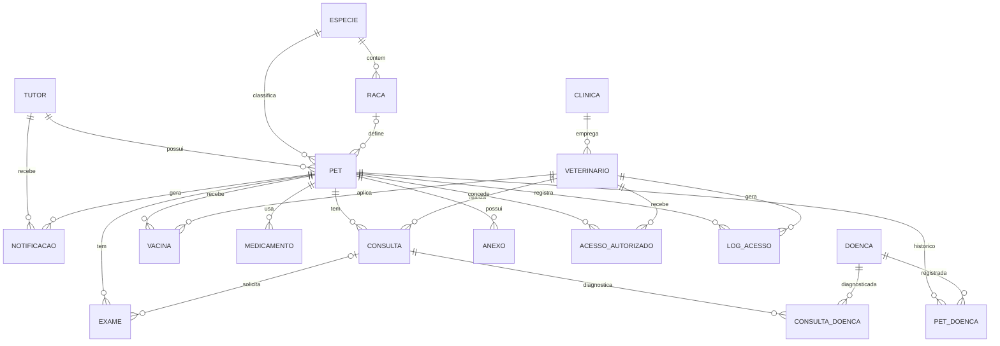
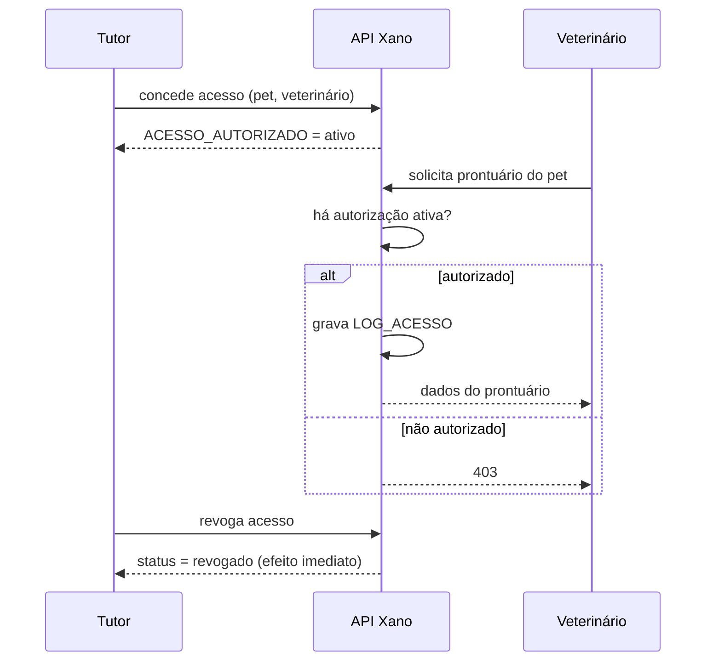

# VetTech — Documentação do Projeto

> Prontuário digital para pets: o histórico de saúde do animal acompanha o pet por toda a vida, independentemente de clínica, cidade ou veterinário.

**Fonte de verdade:** o modelo de dados (DER) e o xanoscript em `/xano`. Toda alteração na modelagem deve ser refletida no diagrama e no script.

---

## Sumário

1. [Visão geral](#1-visão-geral)
2. [Problema e objetivos](#2-problema-e-objetivos)
3. [Usuários e perfis](#3-usuários-e-perfis)
4. [Escopo](#4-escopo)
5. [Requisitos funcionais](#5-requisitos-funcionais)
6. [Regras de negócio](#6-regras-de-negócio)
7. [Arquitetura](#7-arquitetura)
8. [Modelo de dados](#8-modelo-de-dados)
9. [Permissões e auditoria](#9-permissões-e-auditoria)
10. [Segurança e LGPD](#10-segurança-e-lgpd)
11. [Estratégia de desenvolvimento](#11-estratégia-de-desenvolvimento)
12. [Princípios de modelagem](#12-princípios-de-modelagem)
13. [Estrutura do repositório](#13-estrutura-do-repositório)
14. [Pontos em aberto](#14-pontos-em-aberto)
15. [Glossário](#15-glossário)

---

## 1. Visão geral

O VetTech é uma plataforma web que centraliza o histórico médico completo de cada pet em um ambiente seguro e acessível. O sistema conecta **tutores** e **veterinários**: o tutor é dono dos dados do animal e decide quem pode acessá-los.

## 2. Problema e objetivos

### Problema
O histórico médico de pets está fragmentado em cadernetas de papel, arquivos físicos e sistemas isolados de cada clínica. Consequências:

- repetição desnecessária de exames;
- risco de erro médico por falta de informação (ex.: alergias não comunicadas);
- perda de continuidade no acompanhamento de doenças crônicas;
- dificuldade do tutor em controlar vacinas e medicações.

### Objetivos
- Centralizar o histórico médico completo de cada pet em um único sistema.
- Garantir que o prontuário acompanhe o pet independentemente da clínica atendida.
- Reduzir riscos médicos causados por falta de informação nos atendimentos.
- Dar ao tutor controle sobre quem acessa os dados do seu animal.
- Facilitar o acompanhamento de vacinas, medicações e retornos com lembretes automáticos.

## 3. Usuários e perfis

| Perfil | Necessidade | Pode |
|---|---|---|
| **Tutor** | Organização e controle da saúde dos pets | Cadastrar e gerenciar os próprios pets; conceder/revogar acesso a veterinários; ver histórico de acessos; receber notificações; exportar PDF |
| **Veterinário** | Acesso rápido e confiável ao histórico do paciente | Registrar consultas, vacinas e diagnósticos **somente** em pets com autorização ativa |
| **Clínica** | Agrupar veterinários | Empregar vários veterinários. **Não acessa prontuários diretamente**; o acesso é sempre individual |

Clínicas de emergência/plantão se beneficiam do acesso rápido a informações críticas em situações urgentes (atendidas pelo mesmo fluxo de autorização).

## 4. Escopo

### Dentro do escopo
Aplicação web com: cadastro de tutores, veterinários e clínicas; perfil completo do pet; registro de consultas, exames, vacinas, medicamentos e doenças; sistema de permissões de acesso; log de auditoria; notificações automáticas; exportação em PDF.

### Fora do escopo inicial (evolução futura)
- Módulo de pagamento
- Telemedicina em vídeo
- Aplicativo mobile nativo

## 5. Requisitos funcionais

| # | Funcionalidade | Descrição |
|---|---|---|
| RF01 | Cadastro e autenticação | Tutores e veterinários se cadastram e fazem login |
| RF02 | Perfil do pet | Dados, foto, espécie, raça |
| RF03 | Histórico médico | Consultas, exames e diagnósticos |
| RF04 | Carteira de vacinação | Vacinas aplicadas com alerta de reforço |
| RF05 | Controle de medicamentos | Contínuos, vermífugo, antipulgas/carrapatos e outros |
| RF06 | Registro de doenças | Diagnóstico pontual (por consulta) e histórico consolidado (por pet) |
| RF07 | Permissões | Tutor autoriza e revoga acesso de veterinários |
| RF08 | Log de auditoria | Quem acessou, editou ou exportou dados |
| RF09 | Notificações automáticas | Vacina, retorno, medicamento |
| RF10 | Exportação | Relatório PDF do histórico completo |

## 6. Regras de negócio

### Acesso
- **RN01** Apenas o tutor autoriza ou revoga o acesso de um veterinário ao prontuário do seu pet.
- **RN02** O veterinário só visualiza, edita ou exporta dados de pets aos quais foi explicitamente autorizado (autorização com status "ativo").
- **RN03** Ao revogar, o veterinário perde o acesso imediatamente.
- **RN04** Um pet pode ter vários veterinários autorizados ao mesmo tempo.
- **RN05** O tutor só visualiza e gerencia os pets vinculados a ele.

### Auditoria
- **RN06** Toda visualização, edição ou exportação gera registro em LOG_ACESSO (data, veterinário, pet, ação).
- **RN07** O log não pode ser editado nem apagado por nenhum usuário.
- **RN08** O tutor e a administração do sistema podem consultar quem acessou os dados e quando.

### Unicidade e integridade
- **RN09** Tutor: CPF e e-mail únicos.
- **RN10** Veterinário: CRMV único.
- **RN11** Clínica: CNPJ único.
- **RN12** Espécie: nome único.
- **RN13** Toda raça pertence a exatamente uma espécie; o pet não pode receber raça de outra espécie.
- **RN14** A raça do pet é opcional (em branco = SRD, sem raça definida).
- **RN15** Todo pet pertence a exatamente um tutor.
- **RN16** O histórico do pet nunca é apagado, mesmo com mudança de clínica ou veterinário.
- **RN17** O sistema suporta múltiplas clínicas e veterinários por pet sem duplicar o histórico.

### Registros clínicos
- **RN18** Toda consulta tem um pet e um veterinário responsável.
- **RN19** Um exame sempre pertence a um pet e pode (ou não) estar ligado a uma consulta (exame avulso).
- **RN20** Toda vacina tem pet e veterinário aplicador; guarda a data de aplicação e, quando aplicável, a próxima dose (base para lembretes).
- **RN21** Medicamento tem tipo: contínuo (sem data de fim), vermífugo, antipulgas/carrapatos ou outro.
- **RN22** Doença é um cadastro genérico e reutilizável, ligada a consultas (diagnóstico pontual) e a pets (histórico consolidado, com status).
- **RN23** Um anexo pertence a um pet e não depende de consulta ou exame para existir.
- **RN24** Toda notificação pertence a um pet e ao tutor que a recebe; controla se foi enviada e visualizada.

## 7. Arquitetura

| Camada | Tecnologia | Responsabilidade |
|---|---|---|
| Banco de dados | Xano | Tabelas, relacionamentos, integridade |
| Backend / API | Xano (xanoscript) | Regras de negócio, autenticação, validações, autorização |
| Frontend | Python + Reflex | Interface web responsiva com dashboards distintos para tutor e veterinário |
| Arquivos | URL/arquivo vinculado ao pet | Exames, laudos, receitas, fotos |

## 8. Modelo de dados

### Diagrama entidade-relacionamento

### Entidades

Campos de chave primária (`id`) e chaves estrangeiras são implícitos; as FKs seguem os relacionamentos abaixo.

#### TUTOR
Campos: nome, CPF (único), e-mail (único), telefone, endereço, senha (hash).
Relaciona-se com: PET (1:N), NOTIFICACAO (1:N).

#### VETERINARIO
Campos: nome, CRMV (único), especialidade, e-mail, telefone, senha (hash), clínica.
Relaciona-se com: CLINICA (N:1), CONSULTA (1:N), VACINA (1:N), ACESSO_AUTORIZADO (1:N), LOG_ACESSO (1:N).

#### CLINICA
Campos: nome, CNPJ (único), endereço, telefone.
Relaciona-se com: VETERINARIO (1:N).

#### ESPECIE
Campos: nome (único).
Relaciona-se com: RACA (1:N), PET (1:N).

#### RACA
Campos: nome, espécie.
Relaciona-se com: ESPECIE (N:1), PET (1:N).

#### PET
Campos: nome, espécie, raça (opcional), sexo, data de nascimento, peso, cor da pelagem, nº de microchip (opcional), foto, tutor.
Relaciona-se com: TUTOR, ESPECIE, RACA (N:1); CONSULTA, EXAME, VACINA, MEDICAMENTO, PET_DOENCA, ANEXO, NOTIFICACAO, ACESSO_AUTORIZADO, LOG_ACESSO (1:N).

#### CONSULTA
Campos: data, motivo, diagnóstico, observações, pet, veterinário.
Relaciona-se com: PET (N:1), VETERINARIO (N:1), EXAME (1:N), CONSULTA_DOENCA (1:N).

#### EXAME
Campos: tipo, data, resultado, arquivo anexado (laudo, imagem, PDF), pet, consulta (opcional).
Relaciona-se com: PET (N:1), CONSULTA (N:1, opcional).

#### VACINA
Campos: nome, data de aplicação, lote, data da próxima dose (opcional), pet, veterinário.
Relaciona-se com: PET (N:1), VETERINARIO (N:1), NOTIFICACAO (indireta, por referência).

#### MEDICAMENTO
Campos: nome, dosagem, frequência, período de uso, tipo (contínuo, vermífugo, antipulgas/carrapatos, outro), pet.
Relaciona-se com: PET (N:1).

#### DOENCA
Campos: nome, descrição, tipo, gravidade.
Cadastro genérico e reutilizável. Relaciona-se com CONSULTA (N:N via CONSULTA_DOENCA) e PET (N:N via PET_DOENCA).

#### CONSULTA_DOENCA (associativa)
Liga CONSULTA e DOENCA: diagnóstico pontual feito na consulta.

#### PET_DOENCA (associativa)
Liga PET e DOENCA: histórico consolidado, com **status** (ativa, em tratamento, curada, controlada).

#### ANEXO
Campos: tipo (foto, receita, laudo, outro), arquivo, pet.
Independe de consulta ou exame. Relaciona-se com: PET (N:1).

#### NOTIFICACAO
Campos: pet, tutor, referência genérica ao evento (vacina, medicamento, retorno), enviada (sim/não), visualizada (sim/não).
Relaciona-se com: PET (N:1), TUTOR (N:1).

#### ACESSO_AUTORIZADO
Campos: pet, veterinário, status (ativo/revogado).
Só o tutor cria, mantém ou revoga. Relaciona-se com: PET (N:1), VETERINARIO (N:1).

#### LOG_ACESSO
Campos: pet, veterinário, ação (visualização, edição, exportação), data.
Imutável. Relaciona-se com: PET (N:1), VETERINARIO (N:1).

## 9. Permissões e auditoria

### Fluxo de autorização

### Matriz de acesso

| Recurso | Tutor (dono) | Veterinário autorizado | Veterinário sem autorização | Clínica |
|---|---|---|---|---|
| Dados do pet | Ler/editar | Ler | Nenhum | Nenhum |
| Consultas, exames, vacinas, medicamentos, doenças | Ler | Ler/registrar | Nenhum | Nenhum |
| Autorizações | Criar/revogar | Nenhum | Nenhum | Nenhum |
| LOG_ACESSO | Ler (do seu pet) | Nenhum | Nenhum | Nenhum |
| Exportar PDF | Sim | Sim (gera log) | Não | Não |

## 10. Segurança e LGPD

- Senhas armazenadas com **hash**, nunca em texto puro.
- Controle de acesso baseado em autorização explícita do tutor.
- Auditoria completa de acessos e alterações via LOG_ACESSO, alinhada aos princípios da LGPD.
- Separação de responsabilidades entre perfis (tutor × veterinário).
- Integridade referencial por chaves estrangeiras entre todas as entidades.
- Validação adicional na camada de aplicação (ex.: raça deve pertencer à espécie selecionada).

## 11. Estratégia de desenvolvimento

Desenvolvimento incremental por módulo:

1. Modelagem do banco (DER e xanoscript)
2. Definição da arquitetura (backend/frontend)
3. Cadastro → prontuário → permissões → notificações
4. Testes com dados simulados (mock data)
5. Ajustes de usabilidade nas telas do tutor e do veterinário
6. Documentação final para entrega acadêmica

## 12. Princípios de modelagem

- Modelagem orientada ao usuário final: pet e tutor no centro, não a clínica.
- Normalização para evitar inconsistências (espécie/raça padronizadas).
- Tabelas associativas para relações N:N (Pet-Veterinário, Pet-Doença, Consulta-Doença).
- Documentação incremental do modelo conforme surgem novas necessidades.

## 13. Estrutura do repositório

| Caminho | Conteúdo |
|---|---|
| `vet_tech/` | Frontend em Reflex |
| `xano/` | xanoscript e artefatos do backend |
| `docs/` | Documentação e DER |
| `openspec/` | Especificações |
| `rxconfig.py`, `reflex.lock`, `requirements.txt` | Configuração e dependências do Reflex |
| `AGENTS.md`, `CLAUDE.md` | Instruções para agentes de IA |

## 14. Pontos em aberto

1. **Anexos de exame:** a visão geral trata o arquivo como "quando aplicável"; o modelo exige no mínimo 1. Além disso, ANEXO está ligado apenas a PET, sem ligação direta a EXAME. Definir se haverá relação EXAME–ANEXO.
2. **Data de retorno:** há notificação de retorno, mas CONSULTA não tem campo de data de retorno.
3. **Perfil administrador:** o log é consultável pela "administração do sistema", mas não há perfil admin descrito.
4. **Cadastro de pet:** confirmar que apenas o tutor cadastra pets.
5. **Canal de notificação:** apenas dentro do sistema ou também e-mail?
6. **Relação Pet–Veterinário:** coberta por ACESSO_AUTORIZADO; confirmar se basta ou se haverá vínculo clínico separado.

## 15. Glossário

| Termo | Significado |
|---|---|
| Tutor | Responsável legal e dono dos dados do pet |
| CRMV | Registro profissional do médico-veterinário |
| SRD | Sem raça definida |
| Prontuário | Histórico médico consolidado do pet |
| Diagnóstico pontual | Doença identificada em uma consulta específica |
| Histórico consolidado | Situação das doenças do pet ao longo do tempo |
| DER | Diagrama entidade-relacionamento |
| LGPD | Lei Geral de Proteção de Dados |
